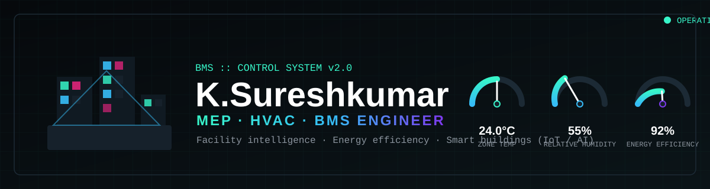

<p align="center">
  
</p>

<p align="center">
  
</p>

<p align="center">
  
  
  
  
  
</p>

---

## 🖥️ System Log

```text
$ bms status --profile sureshkumar

Initializing building intelligence ............ [ OK ]
HVAC controls (AHU/FCU/VAV/FAHU) .............. [ ONLINE ]
Chillers & pumps .............................. [ RUNNING ]
VFDs, sensors & dampers ....................... [ CALIBRATED ]
Fire-system interlocks ........................ [ ARMED ]
Solar PV array ................................ [ PRODUCING ]
SCADA & DDC controllers ....................... [ SYNCED ]
BMS team supervision .......................... [ ACTIVE ]
R&D — Smart HVAC / IoT / DCV / IAQ ............ [ IN PROGRESS ]

>> Facility uptime: 4+ years across MEP, Electrical, Solar & Construction
>> Current task: BMS/IBMS + AI engineering solutions for hospitals
```

---

## 🎛️ Control Zones

| Zone | Equipment & Skills | Status |
|------|--------------------|--------|
| ❄️ **HVAC** | Design, load calc, chillers, AHU / FCU / VAV / FAHU, air balancing | 🟢 Nominal |
| 📟 **BMS / Automation** | SCADA, DDC controllers, EcoStruxure, TIA Portal V20, IoT sensors | 🟢 Online |
| 🏢 **MEP** | Mechanical / Electrical / Plumbing coordination, commissioning | 🟢 On site |
| ☀️ **Solar PV** | Design, installation, testing, energy assessment | 🟢 Producing |
| ⚡ **Energy** | Audits, efficiency retrofits, sustainability | 🟢 Optimizing |
| 💻 **Digital** | HTML, CSS, JS, TypeScript, MATLAB, SolidWorks, Revit | 🟢 Synced |

---

## 🏆 Achievements

<p align="center">
  
</p>

### 🎓 Education

- **HND in Building Services Engineering Technology** — *2024*
- **BEng (Hons) Mechanical Engineering Technology** — *currently pursuing*

### 🌍 Professional Milestones

- 🇸🇦 **International Experience** — Delivered BMS/SCADA engineering services in a hospital environment in Saudi Arabia
- 🏢 **4+ Years Multidisciplinary Career** — MEP, Electrical, Solar PV, Construction & BMS
- 👷 **Leadership Growth** — Progressed into technical supervision and BMS team coordination
- 🔧 **Field Troubleshooting** — BMS, HVAC controls, VFDs, sensors, dampers and fire-system interlocks
- ☀️ **Solar PV Engineering** — Design, installation, testing and energy assessment

### 💡 Research & Development

- Engineering research on **Smart HVAC, IoT/BMS, DCV, IAQ and energy efficiency** for hospital buildings
- Developing **BMS/IBMS & AI-based engineering solutions** — combining building engineering with digital technology

---

## 📂 Instrument Panels (Projects)

| 🚀 Panel | 📝 Description | ⚙️ Stack |
|----------|----------------|----------|
| [Portfolio Site](https://github.com/Suresh199920/portfolio-site) | Personal portfolio & professional website | HTML, CSS, JS |
| [GlobeTrekker Adventures](https://github.com/Suresh199920/GlobeTrekkerAdventures) | Travel website project | HTML, CSS |
| [Wedding Invitation](https://github.com/Suresh199920/wedding-invitation) | Digital wedding invitation | CSS |
| [New Project](https://github.com/Suresh199920/New-Project-1) | TypeScript project | TypeScript |

---

## 📈 Performance Metrics

<p align="center">
  
  
</p>

<p align="center">
  
</p>

<p align="center">
  
</p>

---

## 📡 Communication Channels

<p align="center">
  <a href="https://github.com/Suresh199920"></a>
  <a href="https://www.linkedin.com/in/"></a>
  <a href="mailto:kumarjoe1992@gmail.com"></a>
</p>

<hr/>

<p align="center">
  
  
</p>